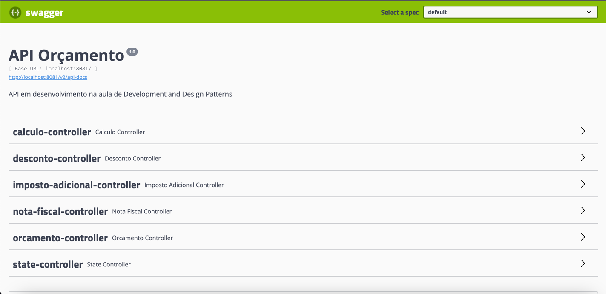

# API Hash

   

## Tópicos

  <a href="#Descrição do Projeto">Imposto</a> •
  <a href="#tecnicas-e-tecnologias-utilizadas">Orçamento</a> •
  <a href="#tecnicas-e-tecnologias-utilizadas">Strategy</a> •
  <a href="#tecnicas-e-tecnologias-utilizadas">Decorator</a> •
  <a href="#tecnicas-e-tecnologias-utilizadas">Chain of Responsibility</a> 
   •
  <a href="#tecnicas-e-tecnologias-utilizadas">Template Method</a> 

## Descrição do Projeto

Aplicação Java com SPRING BOOT, API em desenvolvimento na aula de Development and Design Patterns.

## Integrantes da equipe

Gabriel Menoi - RA:602655

Gabriel Mielo - RA:601128

Matheus Araújo - RA:603236

Tiago Santos  -  RA: 603181

[//]: # (## Técnicas e tecnologias utilizadas)

[//]: # ()
[//]: # (### Técnicas)

[//]: # ()
[//]: # (- `Arquitetura`: Este projeto seguirá o padrão de arquitetura MVVM &#40;Model, View e View-Model&#41;)

[//]: # ()
[//]: # (### Tecnologias)

[//]: # ()
[//]: # (- [Padrão de icones - Widgets Cupertino]&#40;https://pub.dev/packages/cupertino_icons&#41;)

[//]: # (- [Utilizar fontes do Google]&#40;https://pub.dev/packages/google_fonts&#41;)

[//]: # (- [Internacionalização e Localização de Texto]&#40;https://pub.dev/packages/intl&#41;)

[//]: # (- [Formatação de textos para uma mascara determinada]&#40;https://pub.dev/packages/mask_text_input_formatter&#41;)

[//]: # ()
[//]: # (## Abrir e rodar)

[//]: # ()
[//]: # (**Para executar este projeto você precisa:**)

[//]: # ()
[//]: # (- Ter o [Flutter]&#40;https://flutter.dev/docs/get-started/install&#41; instalado na sua máquina)

[//]: # (- Ter algum editor de códigos ou IDE como o [Android Studio]&#40;https://developer.android.com/studio&#41;.)

[//]: # ()
[//]: # (Caso opte por IDEs como as duas sugeridas acima, o processo de execução do aplicativo funcionará)

[//]: # (através de um botão de play na parte superior que ambas dispõem. Caso escolha rodar o projeto via)

[//]: # (linha de comandos, utilize o comando `flutter run`. Lembre-se de antes de executar o comando de)

[//]: # (navegar até a pasta do projeto e baixar suas dependências. Para baixar as dependências do projeto)

[//]: # (você pode abrir o arquivo `pubspec.yaml` localizado na raiz do projeto e clicar no botão `Pub get`)

[//]: # (na parte superior da IDE, para baixar as dependências via linha de comandos, digite o)

[//]: # (comando `flutter pub get`.)

[//]: # ()
[//]: # (## Acesso ao projeto)

[//]: # ()
[//]: # (O acesso ao projeto está separado da seguinte forma:)

[//]: # ()
[//]: # (lib)

[//]: # (├───l10n)

[//]: # (├───pages)

[//]: # (│   ├───login)

[//]: # (│   ├───register)

[//]: # (│   │   ├───pages)

[//]: # (│   │   └───validations)

[//]: # (│   └───splash)

[//]: # (├───shared)

[//]: # (│   ├───images)

[//]: # (│   ├───routes)

[//]: # (│   ├───styles)

[//]: # (│   └───validations)

[//]: # (└───widgets)

[//]: # ()
[//]: # (### Ajustes e melhorias)

[//]: # ()
[//]: # (O projeto ainda está em desenvolvimento, as tarefas finalizadas estão marcadas e, nas)

[//]: # (próximas atualizações, serão cumpridas outras tarefas pendentes:)

[//]: # ()
[//]: # (- [x] Tela de Splash;)

[//]: # (- [x] Tela de Login;)

[//]: # (- [x] Login integração com API;)

[//]: # (- [x] Telas de "Esqueci minha senha";)

[//]: # (- [x] Desenvolvimento de Fluxo/Telas de Cadastro;)

[//]: # (- [x] Cadastro Integrado com API;)

[//]: # ()
[//]: # (- [ ] Home Page;)

[//]: # (    - [x] Categorias;)

[//]: # (    - [ ] Favoritos;)

[//]: # (    - [ ] Detalhes de Serviços;)

[//]: # (    - [ ] Agendamento;)

[//]: # (    - [ ] Carrinho de compras;)

[//]: # (    - [ ] Checkout.)

[//]: # ()
[//]: # (- [x] Perfil;)

[//]: # (    - [x] Meus Pedidos;)

[//]: # (    - [x] Meus cartões;)

[//]: # (    - [x] Sobre o App;)

[//]: # (        - [x] Termos de Uso;)

[//]: # (        - [x] Políticas de Privacidade.)

[//]: # ()
[//]: # (## Licença)

[//]: # ()
[//]: # (Esse projeto está sob licença de [Persys]&#40;https://persys.com.br/desenvolvimento/&#41;.)

[//]: # ()
[//]: # ([Voltar ao topo]&#40;#homedoctor_mcommerce&#41; )
